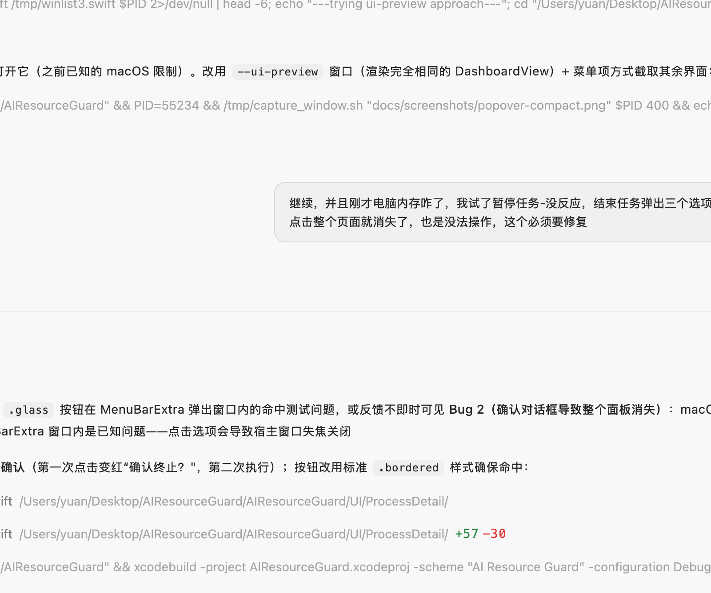
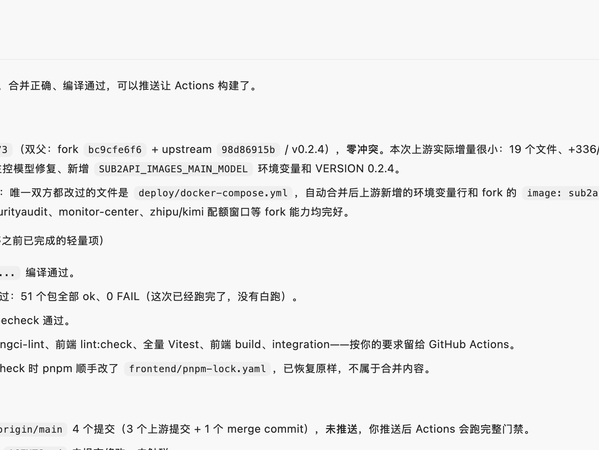
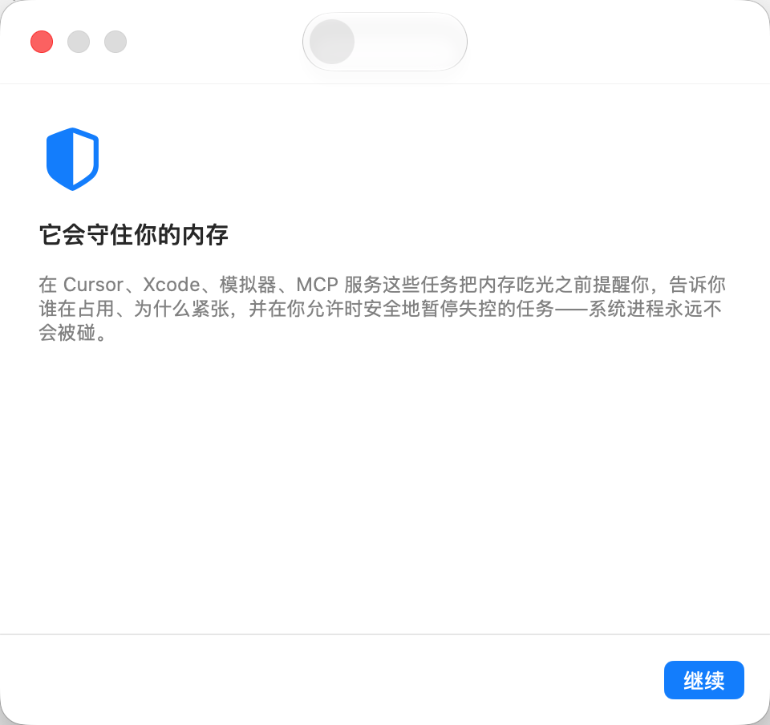

# 内存守护 · AI Resource Guard

一款 macOS 菜单栏工具，专为在 Mac 上跑 AI 开发任务的人准备。

如果你也遇到过这样的场景——Cursor、Xcode、模拟器、MCP 服务、构建任务同时开着，内存不知不觉被吃光，Swap 悄悄涨满，风扇狂转之后整个系统卡死，重启之后却查不到是谁干的——它会替你盯着，并在一切太迟之前出手。

| 主面板 | 设置 |
|:---:|:---:|
|  |  |

| 事件报告 | 首次使用引导 |
|:---:|:---:|
|  |  |

## 它能为你做什么

**一眼看到还剩多少余地**

点开面板，正中央只有一个大数字：系统余量。还剩几 GB、还剩百分之几，一根细条一目了然。机器正常时它就只有这么多——不会用一堆仪表盘淹没你。Swap 的用量和涨势，安静地跟在下面一行。

**面板随局面伸缩**

平时它只是一个安静的小面板（状态 + 余量）；当内存开始紧张，面板自动展开一档，多出一句解释和"谁在占用内存"的名单；真正危险时再展开一档，行动选项就位。你不关心细节的时候，它不塞给你细节。

**用一句话告诉你发生了什么，而不是一堆指标**

> "Swap 已达到 14.5 GB，接近上限"
> "ZCode 是最近 5 分钟增长最快的应用"

以及原因判断：一个应用增长失控、多个应用同时在涨、内存交换过于频繁、遗留任务占用内存、构建任务高峰。看不懂的术语不会出现在这里。

**告诉你谁值得怀疑，而不是谁的内存最大**

"谁在占用内存"的名单里，正在快速膨胀的应用标着"增长异常"排在最前面——一个正在膨胀的 800 MB 进程，比一个安安静静的 3 GB 浏览器危险得多。它还认识这台电脑上每个应用的"平时"水平：一个从不超 1 GB 的应用涨到 2.5 GB，比常年 4 GB 的应用更值得警惕。

**谁的孩子谁抱走**

node、MCP 服务、Gradle、xcodebuild 这些后台进程不再各自为政，而是归属到启动它们的父应用名下：ZCode 名下是它的 node 和 MCP，IntelliJ 名下是 java 和 Gradle，Xcode 名下是整个构建工具链。构建早结束、编辑器早关了却还占着几百 MB 不走的，会标为"遗留任务"，一键结束。

**实在查不出来的时候，说实话**

偶尔系统压力很大，但内存散落在无数小进程和系统服务里，找不到单一元凶。这时它不会假装"一切正常"，而是直接告诉你"没有单一明显来源，先看占用最高的应用"或"部分内存去向不明"——诚实比漂亮重要。

**危险来临前的主动保护**

你决定它出事时可以做到哪一步：只观察（只提醒不动作）、自动暂停、或紧急终止。它挑选目标时只考虑低影响高收益的后台任务：优先释放内存多、增长异常、没人正在使用的，你正在使用的应用受到最强保护。每个应用的处理方式单独设定。

**温和地恢复**

自动暂停的任务不会在压力稍有缓解时一拥而上地恢复：系统稳定一段时间后，每次只恢复一个，确认无恙再恢复下一个；一旦再次承压，刚恢复的任务会被重新暂停。所有动作都直接告诉你："已暂停 ZCode 任务""系统压力已恢复，全部任务已恢复"。

**出事之后，给你一份完整的事故报告**

无论机器是真的卡死过还是只是虚惊一场，"事件报告"按事件整理好每一次压力过程——什么时候开始、峰值多严重、Swap 怎么涨的、哪个应用增长最异常、执行了什么保护动作、什么时候恢复，最后给出最可能的原因：

> 14:45 起风险升至「即将失控」，15:10 达到峰值（Swap 14.3 GB），15:23 恢复正常，持续约 38 分钟。
> 期间 ZCode 内存从 205 MB 增至 1.79 GB（+1.59 GB），为增长最异常的任务。
> 最可能原因：ZCode 快速增长把系统推入 Swap。

**懂你的机器**

它会学习你这台机器"正常"的样子——平时的 Swap 水位、交换频率、每个应用平时的占用量——并以此判断什么才算"异常"。8 GB 的 Swap 在别人机器上是事故，在你的机器上可能只是日常。学习只发生在真正平稳的时段，出过事之后还会留一段冷却期，确保不会把反常当成常态记下来。

## 你的系统是安全的

这些原则不会被任何设置绕过：

- 系统关键进程（内核、登录、窗口服务、访达、程序坞等）以及所有 root 进程，永远不会被暂停或终止；
- 默认不自动处理任何应用——每一个可以自动处理的对象都需要你亲手选择；
- 终止任务永远先温和地请求退出，强制退出需要你确认，自动强制退出只在你明确允许后才可能发生，且仅作为最后手段；
- 所有延迟执行的动作都会先核对进程身份（防止系统把 pid 分配给了新进程而误伤）；
- 所有自动操作都有记录可查；无论是正常退出还是意外崩溃，它都会恢复自己暂停过的一切，不会留下一堆冻住的进程。

## 安装与使用

```bash
xcodebuild -project AIResourceGuard.xcodeproj -scheme "AI Resource Guard" \
  -configuration Debug -destination 'platform=macOS,arch=arm64' \
  -derivedDataPath build build
open "build/DerivedData/Build/Products/Debug/AI Resource Guard.app"
```

也可以直接用 Xcode 打开工程运行。首次启动会带你用三步了解它能做什么、通知和保护方式的选择。之后常驻菜单栏，没有 Dock 图标、没有主窗口。长期使用建议把应用拷贝到"应用程序"文件夹（登录启动需要稳定路径）。

如果错过了通知授权，可以到 系统设置 ▸ 通知 里找到"AI Resource Guard"打开。未授权只影响通知，其余功能完整。

## 它有多轻

空闲时 CPU 占用接近 0%，内存几十 MB。内存压力事件由系统内核主动通知而非轮询；系统指标按风险等级自适应节奏（正常时 5 秒一次，紧张时加快），面板没打开时不做无意义的界面刷新。它监控的是内存压力，自己不该成为压力的一部分。

## 说明

- 它是一个原生的 Swift/SwiftUI 应用，只使用 macOS 公开接口，没有内核扩展、没有后台守护进程、不需要 root；
- 由终端命令启动的 root 进程（如 sudo 构建任务）无法被暂停或终止，会显示为受保护状态；
- 历史数据保存在本机（最近 24 小时或 1000 条），不上传任何信息。

## 开发

- 架构与设计说明见 [ARCHITECTURE.md](ARCHITECTURE.md)；
- 单元测试：`xcodebuild test -project AIResourceGuard.xcodeproj -scheme "AI Resource Guard"`，覆盖风险评估、保护策略、目标选择、恢复计划、归因与事故摘要等核心逻辑。
